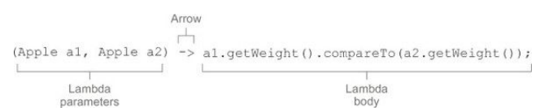

# Java 8 notes

Table of Contents

* [Java 8 notes](#java-8-notes)
  * [Lambda expressions](#lambda-expressions)
     * [Functional interface](#functional-interface)
        * [Common functional interfaces in Java 8](#common-functional-interfaces-in-java-8)
        * [Predicate](#predicate)
        * [Consumer](#consumer)
        * [Function](#function)
     * [Type checking, type interface and restrictions](#type-checking-type-interface-and-restrictions)
        * [Type interface](#type-interface)
        * [Using local variables](#using-local-variables)
     * [Method references](#method-references)
        * [Constructor references](#constructor-references)
     * [Useful methods to compose lambda expressions](#useful-methods-to-compose-lambda-expressions)
        * [Reversed order](#reversed-order)
        * [Chaining comparators](#chaining-comparators)
        * [Composing predicates](#composing-predicates)
        * [Composing functions](#composing-functions)

## Lambda expressions

A _lambda expression_ can be understood as a concise representation of an anonymous function that can be passed around: it doesn’t have a name, but it has a list of parameters, a body, a return type, and also possibly a list of exceptions that can be thrown.

A lambda expression is composed of parameters, an arrow, and a body.


```
(parameters) -> expression
(parameters) -> { statements; }
```

### Functional interface

In a nutshell, a _functional interface_ is an interface that specifies exactly one abstract method.
Lambda expressions let you provide the implementation of the abstract method of a functional interface directly inline and treat the whole expression as an instance of a functional interface.
```
Runnable r1 = () -> System.out.println("123");
```

#### Common functional interfaces in Java 8

| Functional interface    | Function descriptor | Primitive specializations                                                                                                                                                   |
|-------------------------|---------------------|-----------------------------------------------------------------------------------------------------------------------------------------------------------------------------|
| `Predicate<T>`            | T -> boolean        | IntPredicate, LongPredicate, DoublePredicate                                                                                                                                |
| `Consumer<T>`             | T -> void           | IntConsumer, LongConsumer, DoubleConsumer                                                                                                                                   |
| `Function<T, R>`          | T -> R              | IntFunction, IntToDoubleFunction, IntToLongFunction, LongFunction, LongToDoubleFunction, LongToIntFunction, DoubleFunction, ToIntFunction, ToDoubleFunction, ToLongFunction |
| `Supplier<T>`             | () -> T             | BooleanSupplier, IntSupplier, LongSupplier, DoubleSupplier                                                                                                                  |
| `UnaryOperator<T>`        | T -> T              | IntUnaryOperator, LongUnaryOperator, DoubleUnaryOperator                                                                                                                    |
| `BinaryOperator<T>`       | (T, T) -> T         | IntBinaryOperator, LongBinaryOperator, DoubleBinaryOperator                                                                                                                 |
| `BiPredicate<L, R>`       | (L, R) -> boolean   |                                                                                                                                                                             |
| `BiConsumer<T, U>`        | (T, U) -> void      | ObjIntConsumer, ObjLongConsumer, ObjDoubleConsumer                                                                                                                          |
| `BiFunction<T, U, R>`     | (T, U) -> R         | ToIntBiFunction, ToLongBiFunction, ToDoubleBiFunction                                                                                                                       |

If you explore the new Java API, you’ll notice that functional interfaces are annotated with @FunctionalInterface. This annotation is used to indicate that the interface is intended to be a functional interface. The compiler will return a meaningful error if you define an interface using the @FunctionalInterface annotation and it isn’t a functional interface.


1. Common solution
2. Creating functional interface
3. Using a functional interface
4. Passing lambda expression as a parameter

#### Predicate

The java.util.function.Predicate<T> interface defines an abstract method named test that accepts an object of generic type T and returns a boolean.
```
@FunctionalInterface
public interface Predicate<T>{
    boolean test(T t);
}
```

Example:
```
Predicate<String> nonEmptyStringPredicate = (String s) -> !s.isEmpty();
List<String> nonEmpty = filter(listOfStrings, nonEmptyStringPredicate);
```

#### Consumer

The java.util.function.Consumer<T> interface defines an abstract method named accept that takes an object of generic type T and returns no result (void).

```
@FunctionalInterface
public interface Consumer<T> {
    void accept(T t);
}
```

Example:
```
forEach(Arrays.asList(1,2,3,4,5), (Integer i) -> System.out.println(i));
```

#### Function

The java.util.function.Function<T, R> interface defines an abstract method named apply that takes an object of generic type T as input and returns an object of generic type R.

```
@FunctionalInterface
public interface Function<T,R> {
    R apply(T t);
}
```

```
List<Integer> l = map(Arrays.asList("1", "2", "3"), (String s) -> s.length());
```

### Type checking, type interface and restrictions


**Special void-compatibility rule**

If a lambda has a statement expression as its body, it’s compatible with a function descriptor that returns void (provided the parameter list is compatible too). For example, both of the ollowing lines are legal even though the method add of a List returns a boolean and not void as expected in the Consumer context (T -> void):
```
// Predicate has a boolean return
Predicate<String> p = s -> list.add(s);
// Consumer has a void return
Consumer<String> b = s -> list.add(s);
```

#### Type interface

The Java compiler deduces what functional interface to associate with a lambda expression from its surrounding context (the target type), meaning it can also deduce an appropriate signature for the lambda because the function descriptor is available through the target type.

**No explicit type on the parameter:**
```
List<Apple> greenApples = filter(inventory, a -> "green".equals(a.getColor()));
```

#### Using local variables

Lambda expressions are also allowed to use free variables (variables that aren’t the parameters and defined in an outer scope) just like anonymous classes can. They’re called capturing lambdas. For example, the following lambda captures the variable portNumber:
```
int portNumber = 1337;
Runnable r = () -> System.out.println(portNumber);
```

**Closure**

A closure is an instance of a function that can reference nonlocal variables of that function with no restrictions. For example, a closure could be passed as argument to another function. It could also access and modify variables defined outside its scope. Now Java 8 lambdas and anonymous classes do something similar to closures: they can be passed as argument to methods and can access variables outside their scope. But they have a restriction: they can’t modify the content of local variables of a method in which the lambda is defined. Those variables have to be implicitly final. It helps to think that lambdas close over values rather than variables.

### Method references

**Recipe for constructing method references**

1. A method reference to a _static method_ (for example, the method `parseInt` of `Integer`, written `Integer::parseInt`)
2. A method reference to an _instance method_ of an arbitrary type (for example, the method `length` of a `String`, written `String::length`)
3. A method reference to an _instance method of an existing object_ (for example, suppose you have a local variable `expensiveTransaction` that holds an object of type `Transaction`, which supports an instance method `getValue`; you can write `expensiveTransaction::getValue`)

#### Constructor references

You can create a reference to an existing constructor using its name and the keyword new as follows: `ClassName::new`.
```
Supplier<Apple> c1 = Apple::new;
Apple a1 = c1.get();
```

### Useful methods to compose lambda expressions

#### Reversed order

```
apples.sort(comparing(Apple::getWeight).reversed());
```

#### Chaining comparators

```
apples.sort(comparing(Apple::getWeight).reversed().thenComparing(Apple::getColor));
```

#### Composing predicates

```
Predicate<Apple> readApple = (Apple a) -> a.getColor().equals("red");
Predicate<Apple> notRedApple = readApple.negate()
```

```
Predicate<Apple> redHeavvyApple = readApple.and((a) -> a.getWeight() > 150);
```

#### Composing functions

```
Function<Integer, Integer> f = x -> x + 1;
Function<Integer, Integer> g = x -> x * 2;
Function<Integer, Integer> h = f.andThen(g);
int result = h.apply(2);
```

```
Function<String, String> addHeader = Letter::addHeader;
Function<String, String> transformationPipeline = addHeader.andThen(Letter::checkSpelling)
    .andThen(Letter::addFooter);
```